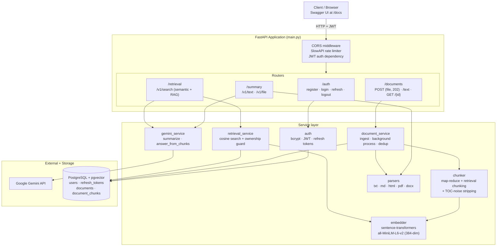
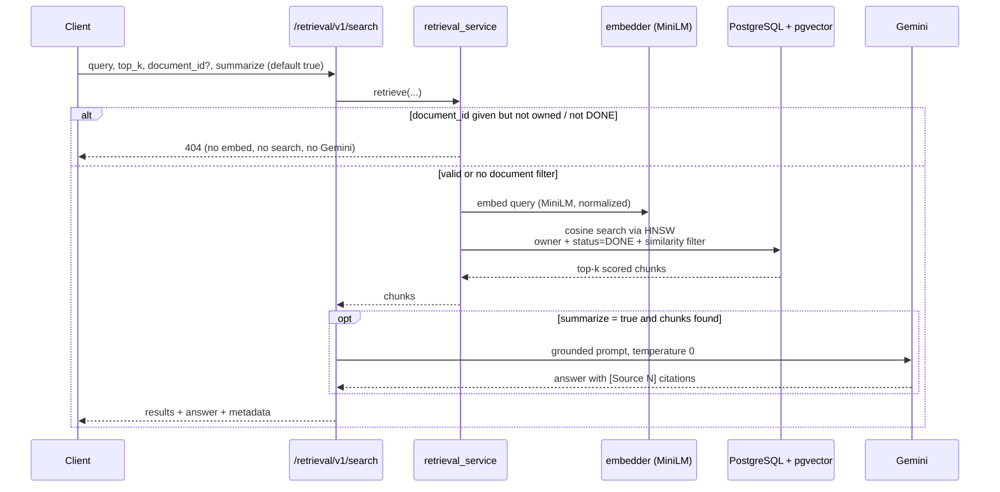

# Summary Generator

A FastAPI service which generates summary for bigger documents.

It exposes JWT-authenticated endpoints to summarize text and uploaded files with Google Gemini, to ingest documents into a pgvector store (chunked and embedded with a local sentence-transformers model), and to run semantic search over those documents with an optional Gemini-generated answer grounded strictly in the retrieved chunks.

## Architecture

The diagram below shows every part of the application and how a request flows through it: the FastAPI app and its middleware, the four routers, the service layer, and the external systems (Google Gemini, the local embedding model, and PostgreSQL + pgvector).



### Retrieval + summarize flow

This is what happens on `POST /retrieval/v1/search`. Note the early ownership guard (a bad `document_id` returns 404 before any expensive work) and the grounding step (Gemini sees only the retrieved chunks).



## Features

- User registration with email validation, username/email uniqueness check, and bcrypt password hashing
- JWT-based login with 15-minute access token expiry; role is included in the JWT (default role: `user`)
- Refresh token support: issue, rotate, and invalidate refresh tokens (7-day expiry, stored hashed in the DB)
- Logout endpoint that deletes the supplied refresh token
- Summarize plain text sent via JSON payload
- Summarize uploaded files: `.txt`, `.md`, `.html`, `.pdf`, `.docx` (max 15 MB)
- Two summary formats: `bullet` (5 bullet points, default) or `paragraph`
- File type detected via MIME sniffing (`python-magic`), not file extension; Markdown is routed by extension because it sniffs as plain text
- Parsers normalize whitespace; HTML strips `<script>`/`<style>`, Markdown is rendered then stripped to prose, PDF is extracted page-by-page, DOCX is extracted paragraph-by-paragraph
- Large documents are automatically split into chunks and summarized with a map-reduce strategy when the token count exceeds 100,000 tokens
- Document ingestion endpoints: upload a file or post raw text, which is chunked into small retrieval-sized windows, embedded locally with `sentence-transformers` (`all-MiniLM-L6-v2`, 384-dim), and stored in PostgreSQL via `pgvector`
- Table-of-contents / index lines (dot-leader rows like `Heading .......... 42`) are stripped during chunking so they never enter the vector index and crowd out real content
- File ingestion (`POST /documents`) runs asynchronously: the request returns `202 Accepted` immediately with a `document_id`, and the parse/chunk/embed/store work runs in a FastAPI background task; clients poll `GET /documents/{document_id}` for status
- Ingestion status lifecycle per document: `pending` → `processing` → `done` | `failed` | `duplicate`, with the failure reason stored on the row
- Per-user content deduplication: documents are hashed by their extracted text (sha256), so re-uploading the same content (even renamed or in a different format) is detected and not re-ingested
- Each stored chunk keeps its source page number and character offset within the page
- Semantic search (`POST /retrieval/v1/search`): the query is embedded with the same local model and ranked against the user's own `DONE` chunks by cosine similarity using the pgvector HNSW index, with a configurable similarity floor; results are scored chunks with their document id, chunk index, and page
- Retrieval-augmented summarization: by default the search also returns a Gemini-generated `answer` grounded strictly in the retrieved chunks — it uses only the supplied sources, cites them as `[Source N]`, runs at temperature 0, and returns a fixed "no information" message when nothing is retrieved; set `summarize: false` for a plain, faster search with no LLM call
- Cost guard on search: a `document_id` that does not exist or is not owned by the caller returns `404` before the query is embedded or Gemini is called
- The embedding model is warmed up at application startup so the first request does not pay the one-time load cost
- A standard response-metadata envelope (`request_id`, `latency_ms`, `timestamp`) is returned on document and retrieval responses for tracing
- All summary, document, and retrieval endpoints require a valid JWT
- Rate limiting on auth endpoints: register (3/min), login (5/min), refresh (10/min), keyed by remote IP
- CORS enabled for all origins
- Structured JSON logging with configurable log level
- Async PostgreSQL via SQLAlchemy 2.0 and asyncpg; migrations managed with Alembic
- Auto-generated API docs at `/docs`

## Project Structure

```
src/summary_generator/
├── main.py                        # FastAPI app, CORS, rate-limit handler, lifespan (embedding warmup), GET / and /health
├── config.py                      # Settings and environment variables (DB, JWT, Gemini, embedding, retrieval tuning)
├── database.py                    # Async SQLAlchemy engine, session factory, Base, get_db dependency
├── dependencies.py                # JWT validation: get_current_user, DbDependency, UserDependency
├── limiter.py                     # Shared slowapi Limiter instance (keyed by remote IP)
├── logging_config.py              # Structured logging configuration; reads LOG_LEVEL
├── models/
│   ├── __init__.py                # Exports all models
│   ├── user.py                    # User table
│   ├── refresh_token.py           # RefreshToken table (hashed token, expiry)
│   └── document.py                # Document and DocumentChunk tables (pgvector embedding column); JobStatus enum
├── schemas/
│   ├── __init__.py
│   ├── auth.py                    # CreateUserRequest, UserResponse, Token, RefreshRequest
│   ├── summary.py                 # SummaryRequest, SummaryResponse
│   ├── document.py                # DocumentTextRequest, DocumentResponse
│   ├── retrieval.py               # RetrievalRequest (incl. summarize flag), RetrievedChunk, RetrievalMetadata, RetrievalResponse
│   └── common.py                  # ResponseMetadata envelope + new_request() request stamping helper
├── routers/
│   ├── __init__.py                # Aggregates auth, summary, documents, retrieval routers into api_router
│   ├── auth.py                    # /auth: register, login, refresh, logout
│   ├── summary.py                 # /summary: POST /v1/text, POST /v1/file
│   ├── documents.py               # /documents: POST "" (file, async 202), POST /text, GET /{document_id}
│   └── retrieval.py               # /retrieval: POST /v1/search (semantic search + optional grounded answer)
├── services/
│   ├── __init__.py
│   ├── auth.py                    # Password hashing, JWT creation, refresh-token helpers
│   ├── chunker.py                 # Token counting, map-reduce splitting, retrieval-chunk splitting, TOC-noise stripping
│   ├── gemini_service.py          # Gemini calls: summarization, and answer_from_chunks (grounded RAG answer)
│   ├── embedder.py                # Lazy sentence-transformers singleton; embeds chunks/query off the event loop
│   ├── document_service.py        # ingest_document (text path), process_document (background file path), dedup helpers
│   └── retrieval_service.py       # retrieve(): ownership guard, query embedding, pgvector cosine search
├── parsers/
│   ├── __init__.py                # extract_text() and extract_pages() dispatch by MIME type
│   ├── text.py                    # Decode and normalize plain text
│   ├── html.py                    # Strip HTML tags, extract visible text (BeautifulSoup)
│   ├── markdown.py                # Render Markdown to HTML, then strip to prose
│   ├── pdf.py                     # Extract text page-by-page (pypdf)
│   └── docx.py                    # Extract paragraph text (python-docx)
└── shared/
    ├── __init__.py
    ├── gemini_client.py           # Single shared google-genai Client instance
    ├── file_validation.py         # Size/MIME validation; extract_document_text and extract_document_pages
    └── parserHelper.py            # normalize(): whitespace normalization used by all parsers

alembic/                           # Database migration scripts
tests/
├── conftest.py                    # Test DB engine, table create/drop, get_db override, async client fixture
├── test_main.py                   # Tests GET /health
├── test_auth.py                   # Tests /auth/register and /auth/login
├── test_services.py               # Unit tests for hash_password, verify_password, create_access_token
├── test_documents.py              # Response-metadata envelope unit tests + document status integration test
├── test_chunker.py                # TOC-noise detection and stripping during retrieval chunking
└── test_retrieval_rag.py          # Grounding, empty-retrieval short-circuit, summarize flag, 404 cost guard, end-to-end search
pyproject.toml                     # Project config, dependencies, scripts
.env                               # Environment variables (not committed)
start.sh                           # Activate venv and start the server
stop.sh                            # Stop the server
Dockerfile                         # Multi-stage build; bakes in the embedding model, runs as non-root
docker-compose.yml                 # Local stack: pgvector Postgres + the API container
docker-entrypoint.sh               # Container startup: runs alembic migrations, then uvicorn (2 workers)
.dockerignore                      # Excludes .venv/.git/etc. from the build context
```

## Requirements

- Python >= 3.11
- PostgreSQL with the `pgvector` extension available

Key dependencies:

| Package | Purpose |
|---|---|
| `fastapi` | Web framework |
| `uvicorn[standard]` | ASGI server |
| `sqlalchemy[asyncio]>=2.0` | Async ORM |
| `asyncpg` | Async PostgreSQL driver |
| `alembic` | Database migrations |
| `pgvector` | Vector column type and similarity search |
| `bcrypt` | Password hashing |
| `python-jose[cryptography]` | JWT creation and verification |
| `python-dotenv` | Loads `.env` |
| `python-multipart` | Form data for login and file uploads |
| `email-validator` | Email format validation |
| `google-genai` | Google Gemini API client |
| `sentence-transformers` | Local embedding model (`all-MiniLM-L6-v2`) |
| `pypdf` | PDF text extraction |
| `python-docx` | DOCX text extraction |
| `markdown` | Markdown rendering |
| `beautifulsoup4` | HTML/Markdown text extraction |
| `python-magic` | MIME type detection from file bytes |
| `slowapi` | Rate limiting |
| `python-json-logger` | Structured logging formatter |

## Installation

```bash
# Install uv
curl -LsSf https://astral.sh/uv/install.sh | sh
source $HOME/.local/bin/env

# Create virtual environment and install dependencies
uv venv
source .venv/bin/activate
uv pip install -e ".[dev]"

# Create the PostgreSQL database and user
psql postgres -c "CREATE DATABASE summary_db;"
psql postgres -c "CREATE USER summary_user WITH PASSWORD 'yourpassword';"
psql postgres -c "GRANT ALL PRIVILEGES ON DATABASE summary_db TO summary_user;"
psql postgres -c "ALTER DATABASE summary_db OWNER TO summary_user;"

# Run migrations (creates tables and enables the pgvector extension)
alembic upgrade head
```

## Running the App

```bash
./start.sh
```

Or directly:

```bash
uvicorn summary_generator.main:app --reload --port 8000
```

The `serve` console script (`summary_generator.main:start`) runs uvicorn on `0.0.0.0:8000` with reload enabled.

Stop the server:

```bash
./stop.sh
```

API docs: `http://localhost:8000/docs`

## Running with Docker

The project ships a multi-stage `Dockerfile` and a `docker-compose.yml` that starts the API alongside a `pgvector`-enabled Postgres. This is the fastest way to run the full stack without installing Python, Postgres, or the embedding model locally.

```bash
# Provide your Gemini key (compose reads it from .env via env_file)
echo "GOOGLE_GEMINI_API_KEY=your-gemini-api-key-here" > .env

# Build and start the database + API
docker compose up --build
```

The API is then available at `http://localhost:8000` (docs at `/docs`).

Notes:

- The `web` container waits for the database healthcheck, then `docker-entrypoint.sh` runs `alembic upgrade head` automatically before starting uvicorn — no manual migration step is needed.
- The embedding model (`all-MiniLM-L6-v2`) is downloaded once at image build time and baked into the image, so containers start offline with no HuggingFace network dependency.
- Compose sets `DATABASE_URL`, `SECRET_KEY`, and `GEMINI_MODEL` for you; only `GOOGLE_GEMINI_API_KEY` comes from your `.env`. The database is `summary` on the `db` service (user/password `postgres`/`postgres`), persisted in the `pgdata` volume.
- The server runs with `--workers 2` and no `--reload` (production-style), and the container exposes a `/health`-based Docker healthcheck.

Stop the stack:

```bash
docker compose down          # keep the database volume
docker compose down -v       # also delete the pgdata volume
```

## API Endpoints

| Method | Path | Auth Required | Description |
|---|---|---|---|
| GET | `/` | No | Root endpoint, returns a CORS-enabled response |
| GET | `/health` | No | Returns service health status |
| POST | `/auth/v1/register` | No | Create a new user account |
| POST | `/auth/v1/login` | No | Login and receive access + refresh tokens |
| POST | `/auth/v1/refresh` | No | Exchange a refresh token for new access + refresh tokens |
| POST | `/auth/v1/logout` | Yes | Invalidate the supplied refresh token |
| POST | `/summary/v1/text` | Yes | Summarize plain text from a JSON payload |
| POST | `/summary/v1/file` | Yes | Summarize an uploaded file |
| POST | `/documents` | Yes | Accept an uploaded file for ingestion; returns `202` and processes in the background |
| POST | `/documents/text` | Yes | Ingest raw text synchronously: chunk, embed, and store |
| GET | `/documents/{document_id}` | Yes | Get the ingestion status and result of a document |
| POST | `/retrieval/v1/search` | Yes | Semantic search over the caller's chunks, with an optional grounded Gemini answer |

### POST /auth/v1/register

Request body:
```json
{
  "email": "user@example.com",
  "username": "string",
  "password": "string",
  "role": "user"
}
```

Response `201`:
```json
{
  "id": 1,
  "email": "user@example.com",
  "username": "string",
  "role": "user",
  "is_active": true
}
```

Rate limit: 3 requests/minute per IP.

### POST /auth/v1/login

Form data: `username`, `password`

Response `200`:
```json
{
  "access_token": "<jwt_token>",
  "token_type": "bearer",
  "refresh_token": "<opaque_token>"
}
```

Access token expires in 15 minutes; refresh token expires in 7 days. Rate limit: 5 requests/minute per IP.

### POST /auth/v1/refresh

Request body:
```json
{
  "refresh_token": "<opaque_token>"
}
```

Response `200`: same shape as login. The old refresh token is deleted and a new one issued (token rotation). Rate limit: 10 requests/minute per IP.

### POST /auth/v1/logout

Header: `Authorization: Bearer <token>`

Request body:
```json
{
  "refresh_token": "<opaque_token>"
}
```

Response `204 No Content`. Deletes the refresh token from the database.

### POST /summary/v1/text

Header: `Authorization: Bearer <token>`

Request body:
```json
{
  "text": "long text to summarize...",
  "summary_format": "bullet"
}
```

`summary_format` is optional and defaults to `bullet`. Accepted values: `bullet`, `paragraph`.

Response `200`:
```json
{
  "summary": ["• First key point...", "• Second key point..."],
  "source_type": "text"
}
```

### POST /summary/v1/file

Header: `Authorization: Bearer <token>`

Multipart form data:
- `file`: the file to upload (`.txt`, `.md`, `.html`, `.pdf`, `.docx`, max 15 MB)
- `summary_format`: optional, `bullet` (default) or `paragraph`

Response `200`: same shape as `/summary/v1/text` with `source_type: "file"`.

Error responses:
- `400` — empty text, no readable content found, or invalid `summary_format`
- `413` — file exceeds 15 MB
- `415` — unsupported file type (detected by MIME type, not extension)

### POST /documents

Header: `Authorization: Bearer <token>`

Multipart form data:
- `file`: the file to upload (`.txt`, `.md`, `.html`, `.pdf`, `.docx`, max 15 MB)

The upload is validated (size and MIME type) on the request, a `pending` document row is created, and the heavy work (extract per page, split into retrieval-sized chunks, embed locally, store) is handed to a background task. The request returns immediately.

Response `202`:
```json
{
  "document_id": 1,
  "filename": "report.pdf",
  "chunks_stored": 0,
  "status": "pending",
  "error": null,
  "metadata": {
    "request_id": "…",
    "latency_ms": 12.3,
    "timestamp": "2026-06-27T12:00:00Z"
  }
}
```

Poll `GET /documents/{document_id}` to follow progress. The status moves `pending` → `processing` → `done`. If the same content was already ingested by this user it ends as `duplicate`; if processing fails it ends as `failed` with the reason in `error`.

Error responses (returned on the request, before queuing):
- `413` — file exceeds 15 MB
- `415` — unsupported file type (detected by MIME type, not extension)

### GET /documents/{document_id}

Header: `Authorization: Bearer <token>`

Returns the current ingestion status and result of a document owned by the caller.

Response `200`:
```json
{
  "document_id": 1,
  "filename": "report.pdf",
  "chunks_stored": 12,
  "status": "done",
  "error": null,
  "metadata": { "request_id": "…", "latency_ms": 4.1, "timestamp": "…" }
}
```

`status` is one of `pending`, `processing`, `done`, `failed`, `duplicate`. `chunks_stored` is populated once `status` is `done`; `error` carries the reason when `status` is `failed` or `duplicate`.

Error response:
- `404` — the document does not exist or is owned by another user

### POST /documents/text

Header: `Authorization: Bearer <token>`

Request body:
```json
{
  "text": "long text to ingest...",
  "title": "optional title"
}
```

The whole input is treated as a single page, chunked, embedded, and stored synchronously (no background task). `title` is used as the document filename. Response `201` with `status: "done"`; a re-upload of identical content returns `200` with the existing document.

Error response:
- `400` — empty text

### POST /retrieval/v1/search

Header: `Authorization: Bearer <token>`

Semantic search over the caller's own `DONE` document chunks. The query is embedded with the same local model used for ingestion, then chunks are ranked by cosine similarity using the pgvector HNSW index. By default the response also includes a Gemini-generated `answer` grounded strictly in the retrieved chunks.

Request body:
```json
{
  "query": "How does CloudFormation work?",
  "top_k": 10,
  "document_id": 18,
  "summarize": true
}
```

- `query` (required) — the search text.
- `top_k` (optional) — max results to return. Defaults to `10`, capped at `40`.
- `document_id` (optional) — restrict the search to a single document the caller owns. Omit it (or send `null`) to search across all the caller's documents.
- `summarize` (optional) — defaults to `true`. When true, also returns a grounded `answer`. Set to `false` for a plain, faster search with no LLM call.

Response `200`:
```json
{
  "query": "How does CloudFormation work?",
  "results": [
    {
      "document_id": 18,
      "chunk_index": 41,
      "page_number": 12,
      "char_start": 773,
      "content": "CloudFormation lets you model and provision …",
      "score": 0.62
    }
  ],
  "answer": "CloudFormation lets you define infrastructure as templates … [Source 1].",
  "metadata": {
    "request_id": "…",
    "latency_ms": 352.4,
    "timestamp": "…",
    "total_results": 1,
    "top_k": 10,
    "document_id": 18,
    "min_similarity": 0.2
  }
}
```

Grounding guarantees: the answer uses only the returned `results` as context, cites them as `[Source N]`, and is generated at temperature 0. If no chunks pass the similarity floor, `results` is empty and `answer` is the fixed message "The provided documents do not contain information to answer this." (no Gemini call is made). When `summarize` is `false`, `answer` is `null`.

An empty corpus or no matches above the similarity threshold returns `200` with an empty `results` list, not an error.

Error response:
- `404` — `document_id` was provided but does not exist, is not owned by the caller, or is not yet `done`. This check runs before the query is embedded or Gemini is called, so an invalid id never incurs that cost.

## Running Tests

Tests run against a separate `summary_test_db` database. Create it first (the test connection uses user `summary_user` with password `summary123`, see `tests/conftest.py`):

```bash
psql postgres -c "CREATE DATABASE summary_test_db;"
psql postgres -c "GRANT ALL PRIVILEGES ON DATABASE summary_test_db TO summary_user;"
psql postgres -c "ALTER DATABASE summary_test_db OWNER TO summary_user;"

# Enable pgvector in the test DB (the DocumentChunk table uses a VECTOR column).
# CREATE EXTENSION requires superuser, so run it as the postgres superuser once.
# The test fixture also attempts this, but will skip if summary_user lacks the
# privilege — so do it here to be safe.
psql -d summary_test_db -c "CREATE EXTENSION IF NOT EXISTS vector;"
```

Then run:

```bash
pytest -v
```

Some retrieval tests embed text with the real `all-MiniLM-L6-v2` model and run pgvector cosine search against the test database; the Gemini network call is mocked.

## Environment Variables

Create a `.env` file in the project root:

```env
DATABASE_URL=postgresql+asyncpg://<user>:<password>@localhost:5432/<dbname>
GOOGLE_GEMINI_API_KEY=your-gemini-api-key-here
SECRET_KEY=your-secret-key-here
GEMINI_MODEL=gemini-2.5-flash
EMBEDDING_MODEL=all-MiniLM-L6-v2
LOG_LEVEL=INFO
```

- `DATABASE_URL` is required — the async PostgreSQL connection string.
- `GOOGLE_GEMINI_API_KEY` is required for summarization and grounded search answers. Get a free key at [aistudio.google.com](https://aistudio.google.com).
- `SECRET_KEY` is optional — a default is used if not set, but always set it in production.
- `GEMINI_MODEL` is optional — defaults to `gemini-2.5-flash`.
- `EMBEDDING_MODEL` is optional — defaults to `all-MiniLM-L6-v2` (384-dim). Changing it to a model with a different output dimension requires updating `EMBEDDING_DIM` in `config.py` and a new migration.
- `LOG_LEVEL` is optional — defaults to `INFO`. Accepted values: `DEBUG`, `INFO`, `WARNING`, `ERROR`.

Retrieval tuning lives in `config.py` (not environment variables): `RETRIEVAL_TOP_K` (default 10), `RETRIEVAL_MAX_TOP_K` (40), `RETRIEVAL_MIN_SIMILARITY` (0.2), and the retrieval chunk sizing (`RETRIEVAL_CHUNK_TOKENS`, `RETRIEVAL_CHUNK_OVERLAP_TOKENS`).

## Database Migrations

```bash
# After changing any file in models/
alembic revision --autogenerate -m "describe what changed"
alembic upgrade head
```
</content>
</invoke>
